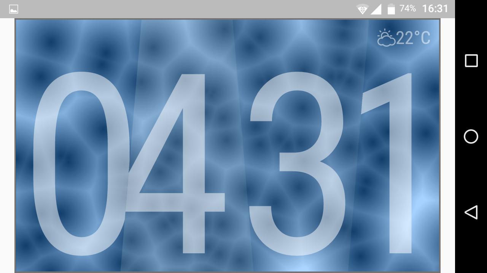
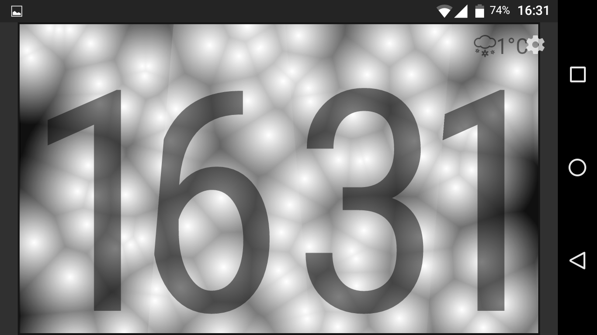

# Melt Clock

This is a clockface for the Lenovo Smart Clock using Flutter and Dart, written for the Flutter Clock challenge.

## Features

Realtime backgound animation, available in two flavors according to the device theme. Also tinted depending on the weathers conditions.

Displays time in digital format through sliced shapes, and weather forecast in upper right corner.

